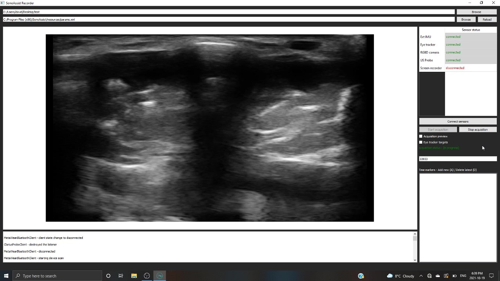

# SonoAsist

**SonoAssist is an open-source project for the acquisition, processing, and visualization of data relevant to the study of sonographer expertise in POCUS (Point of Care Ultrasound) exams. Furthermore, the “SonoAssist” acquisition software was presented at the CMBEC44 conference, and the related [paper](Media/paper.pdf) “SonoAssist: Open source acquisition software for ultrasound imaging studies” presenting the software can be found in the "Media" folder.**

This project is composed of two types of software components
* An acquisition software
* Data processing scripts to manipulate the acquired data

## Acquisition software

The SonoAssist acquisition software is compatible with Windows 10 and can the installer can be found in the releases. 

Note that the configuration parameters for the acquisition software are detailed in the [wiki](https://github.com/OneWizzardBoi/SonoAsist/wiki/Acquisition-software-configuration).

Supported sensors
|Sensor type|Manufacturer|Model|Output format|
|:--- |:---|:--- |:---|
|US Probe|Clarius|L7 Linear|clarius_data.csv & clarius_images.avi|
|Eye tracker|Tobii|4C|eye_tracker_gaze.csv & eye_tracker_head.csv|
|RGB D camera|Intel|Realsens D435|RGBD_camera_index.csv & RGBD_camera_data.bag|
|IMU (external to the probe)|MbientLab|MetaMotionC|ext_imu_acceleration.csv & ext_imu_orientation.csv|
|Screen recorder|None|None|screen_recorder_data.csv & screen_recorder_images.avi|

## User interface

### Main mode
Interface used during acquisitions.

### Preview mode
Interface used when setting up the sensors.

## Processing scripts

The python processing scripts were developed and tested in the Ubuntu operating system and require python3 and pip.
Note that the configuration parameters for the processing scripts are detailed in the [wiki](https://github.com/OneWizzardBoi/SonoAsist/wiki/Processing-scripts-configuration).

### Installing the sonopy package
    - cd SonoAssistScrips/
    - pip install sonopy