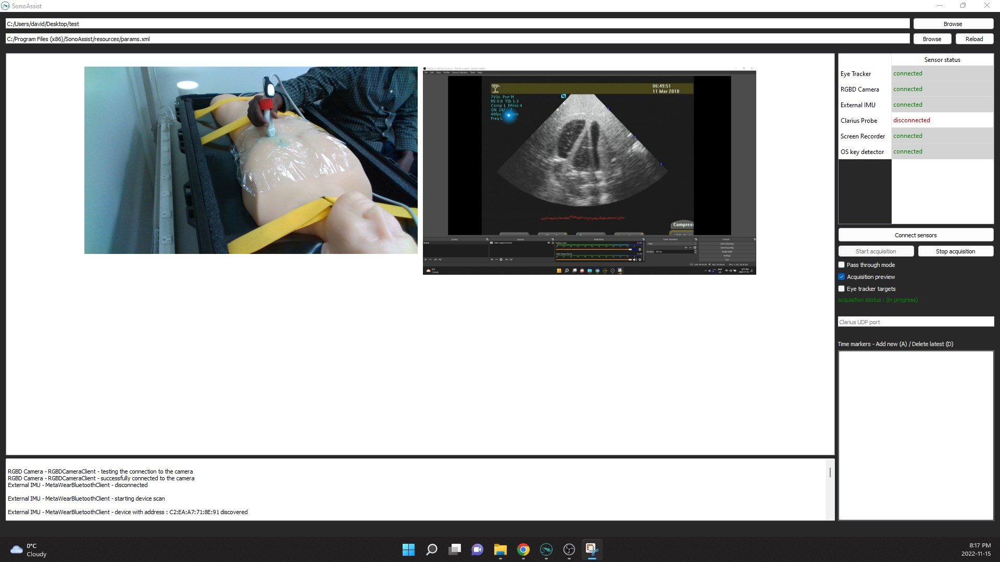

# SonoAssist

**SonoAssist is an open-source project for the acquisition, processing, and visualization of data relevant to the study of sonographer expertise in POCUS (Point of Care Ultrasound) exams. Furthermore, the “SonoAssist” acquisition software was presented at the CMBEC44 conference, and the related [paper](Media/paper.pdf) “SonoAssist: Open source acquisition software for ultrasound imaging studies” presenting the software can be found in the "Media" folder.**

This project is composed of two types of software components
* An acquisition software
* Data processing scripts to manipulate the acquired data

## Acquisition software

The SonoAssist acquisition software is compatible with Windows 10 and 11, and the installer can be found in the releases. 

Note that the configuration parameters for the acquisition software are detailed in the [wiki](https://github.com/OneWizzardBoi/SonoAsist/wiki/Acquisition-software-configuration).

Supported sensors
|Sensor type|Manufacturer|Model|Output format|
|:--- |:---|:--- |:---|
|US Probe|Clarius|L7 Linear|clarius_data.csv & clarius_images.avi|
|Eye tracker|Tobii|4C|eye_tracker_gaze.csv & eye_tracker_head.csv|
|RGB D camera|Intel|Realsens D435|RGBD_camera_index.csv & RGBD_camera_data.bag|
|IMU (external to the probe)|MbientLab|MetaMotionC|ext_imu_acceleration.csv & ext_imu_orientation.csv|
|Screen recorder|None|None|screen_recorder_data.csv & screen_recorder_images.avi|

## User interface

### Main mode
Interface used during acquisitions.

### Preview mode
Interface used when setting up the sensors.

## Processing scripts

The python processing scripts were developed and tested in the Windows and Ubuntu operating systems and require python3 and pip.
Note that the configuration parameters for the processing scripts are detailed in the [wiki](https://github.com/OneWizzardBoi/SonoAsist/wiki/Processing-scripts-configuration).

### Installing the sonopy package
1. Clone this repository
2. Use pip install : `pip install SonoAssist/SonoAssistScrips/sonopy`

## Installing for development (Windows)

1. Install system dependencies
    1. Install the [conan](https://conan.io/) package manager via pip : `pip install conan`
    2. Install [Qt](https://www.qt.io/download-open-source?hsCtaTracking=9f6a2170-a938-42df-a8e2-a9f0b1d6cdce%7C6cb0de4f-9bb5-4778-ab02-bfb62735f3e5). This project is known to be compatible with Qt 5.14.
    3. (Optional) Install the [RealSense SDK](https://www.intelrealsense.com/sdk-2/). The SonoAssist's RealSense build dependencies are handled by Conan, but the SDK comes with useful visualization tools.

2. Clone this repository and navigate to the source folder
    - `git clone ...`
    - `cd SonoAssist/SonoAssist/`

3. Run the `dependencies-download.ps1` script with administrator privileges. You must have previously [allowed script execution on your machine](https://docs.microsoft.com/en-us/powershell/module/microsoft.powershell.security/set-executionpolicy?view=powershell-7.1).
    - `..\Utils\dependencies-download.ps1`

4. Run the following Conan install commands from the source folder
    - `conan install . -s build_type=Debug -if=out/build/x64-Debug`
    - `conan install . -s build_type=Release -if=out/build/x64-Release`

5. Update the `set(CMAKE_PREFIX_PATH C:/Qt/<Qt_version>/<compiler>)` statement in the `CMakeLists.txt` file to match your installed version of Qt.

6. Open the source folder 'SonoAssist/SonoAssist/' in VisualStudio and configure the project with CMake. In VisualStudio, the configuration is done automatically when opening and saving  `CMakeLists.txt.

7. Build the project with VisualStudio: "Build->Build All"

## Extensibility

The [add-sensor-example](https://github.com/LATIS-ETS/SonoAssist/tree/add-sensor-example) branch covers the development steps required to add support for additional sensors. 